<div align="center">
  
</div>

<div align="center">
  <a href="https://github.com/syaizzx"></a>
  <a href="https://github.com/syaizzx?tab=repositories"></a>
  <a href="https://github.com/syaizzx"></a>
</div>

<br />

<div align="center">
  
</div>

<div align="center">
  
</div>

<br />


I'm **Syaiz**, a developer from Indonesia who enjoys turning ambitious ideas into systems people can actually use.

My work usually lives where **interfaces, automation, and game worlds** meet — performant mobile experiences, connected community tools, and economies that create stories instead of just displaying numbers.

```ts
const syaizz = {
  builds: ["web platforms", "mobile apps", "game systems"],
  caresAbout: ["performance", "useful automation", "clean experiences"],
  environment: "Linux",
  loop: "build → measure → refine",
} as const;
```

<div align="center">
  
</div>


| Signal | What I'm exploring |
| :-- | :-- |
| `MOBILE // READER` | A performance-first comic reader built around smooth vertical reading on mobile. |
| `COMMUNITY // BRIDGE` | Discord automation and game integration for communities that feel alive. |
| `WORLD // ECONOMY` | Player-driven economy and civilization systems for persistent multiplayer worlds. |

<div align="center">
  
</div>


| Layer | Tools I reach for |
| :-- | :-- |
| **Interface** | TypeScript · JavaScript · React · React Native · Expo |
| **Runtime** | Node.js · Discord.js · PHP |
| **Data** | MySQL · SQLite |
| **Game side** | Java · Pawn · PaperMC · SA-MP / open.mp |
| **Workbench** | Linux · Git · VS Code |

<div align="center">


</div>

<div align="center">
  
</div>


> Make it useful first. Measure the real bottleneck. Keep the system understandable. Then make it feel alive.

I like projects with moving parts — real-time events, player economies, caching, bots, APIs, and the invisible infrastructure that makes a product feel simple.

<div align="center">
  
</div>


Usually thinking about game economies, historical systems, Linux, or how a small technical decision can change an entire user experience.

<div align="center">
  
</div>


<div align="center">


</div>

<div align="center">
  
</div>

<div align="center">
  <sub><code>root@syaiz:~# echo "have an unusual idea? let's turn it into something real."</code></sub><br /><br />
  <a href="https://github.com/syaizzx"><strong>github.com/syaizzx ↗</strong></a>
</div>
